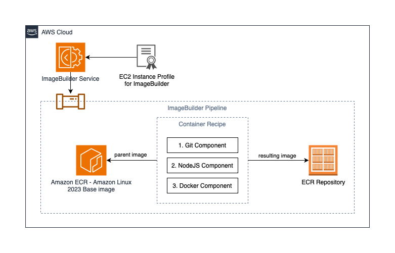

# AWS CDK ImageBuilder Sample

<!--BEGIN STABILITY BANNER-->
---

> **This is a stable example. It should successfully build out of the box**
>
> This example is built on Construct Libraries marked "Stable" and does not have any infrastructure prerequisites to build.
---
<!--END STABILITY BANNER-->

## Overview

This AWS Cloud Development Kit (CDK) TypeScript example demonstrates how to create a fully functional ImageBuilder pipeline that builds an Amazon Linux 2023 container image, installing git, docker and nodejs, all the way to pushing the resulting image to an ECR repository.

## Real-world Example

When working in fast-paced development environments, CI/CD (Continuous Integration and Continuous Delivery) pipelines are used to automatically build, test, and deploy golden images across multiple accounts and environments. This allows new features and bug fixes to be tested and deployed quickly to continuously improve the application.

For example, this pipeline can be used to create the build image that can be used as part of Amazon CodeCatalyst workflow to build applications that require Node version 18 which requires Amazon Linux 2023 and is not currently provided as a built-in image in Amazon CodeCatalyst. Reducing the time needed to bring an Amazon CodeCatalyst workflow up and running.

## Structure

The following resources are created:
- An ECR reposetory to store the built images
- An ImageBuilder recipe that includes the following componenets:
    - install git
    - install nodejs
    - install docker
- instance profile for ImageBuilder build instance
- Infrastructure configuration to tell ImageBuilder which infra to use for the pipeline
- Distribution configuration to tell ImageBuilder to use the ECR repo as the destination for resulting images
- An ImageBuilder pipeline

## Deploying

1. Authenticate to an AWS account via a Command Line Interface (CLI).
2. Navigate to the cloned repo's root directory.
3. `npm ci` to install required dependencies
4. `cdk deploy` to deploy the stack to the AWS account you're authenticated to.

## Additional Commands

- `cdk synth` to generate and review the CloudFormation template.
- `cdk diff` to compare local changes with what is currently deployed.
<!-- - `npm run test` to run the tests we specify in `imagebuilder.test.ts`. -->

## Security

Since this is a sample (not production ready), customers should keep the following points in mind:
- Control permissions related to modifying the container recipe which specifies the source container image and the target container registery, to prevent any unapproved base images to be used, and resulting images to be stored in approved repositories. 
- Enable [AWS CloudTrail](https://docs.aws.amazon.com/awscloudtrail/latest/userguide/cloudtrail-user-guide.html#) to be able to monitor management actions taken against the ImageBuilder pipeline, recipes, compoenets, etc.
- Use ImageBuilder history tab to monitor invocations and triggers of the pipeline and see detailed recipe contents, commands and execution outputs.
- The [ECR](https://docs.aws.amazon.com/AmazonECR/latest/userguide/what-is-ecr.html) repository created as part of this sample uses AWS Managed encryption keys to encrypt the resulting container images at rest. You may want to use your own encryption key using [Amazon KMS](https://docs.aws.amazon.com/AmazonECR/latest/userguide/encryption-at-rest.html).
- For container image vulnerability scanning, consider using [Amazon Inspector ECR scanning feature](https://docs.aws.amazon.com/inspector/latest/user/scanning-ecr.html).
- Follow the [principle of least privilage](https://docs.aws.amazon.com/IAM/latest/UserGuide/best-practices.html#grant-least-privilege) to ensure authorized access to image builder, recipes, etc. is on a need basis.

See [CONTRIBUTING](CONTRIBUTING.md#security-issue-notifications) for more information.

## License

This library is licensed under the MIT-0 License. See the LICENSE file.

